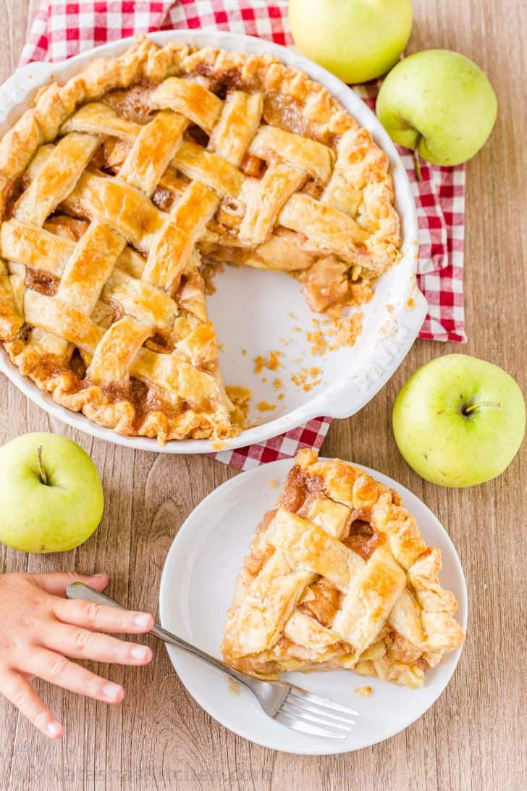

# Apple Pie Recipe 🍎

## *Ingredients*
### *Ingredients for Butter Pie Crust Dough Recipe:*
- 2 1/2 cups all-purpose flour, plus more to dust, *measured correctly
- 1/2 Tbsp granulated sugar
- 1/2 tsp sea salt
- 1/2 lb COLD unsalted butter, (2 sticks) diced into 1/4" pieces
- 7 Tbsp ice water, (7 to 8 Tbsp)

### *For the Filling:*
- 2 1/4 lbs Apples, peeled, cored  6-7 apples (7 cups thinly sliced)
- 1 1/2 tsp cinnamon
- 8 Tbsp unsalted butter
- 3 Tbsp  all-purpose flour
- 1/4 cup water
- 1 cup granulated sugar
- 1 egg , + 1 Tbsp water, for egg wash

  

